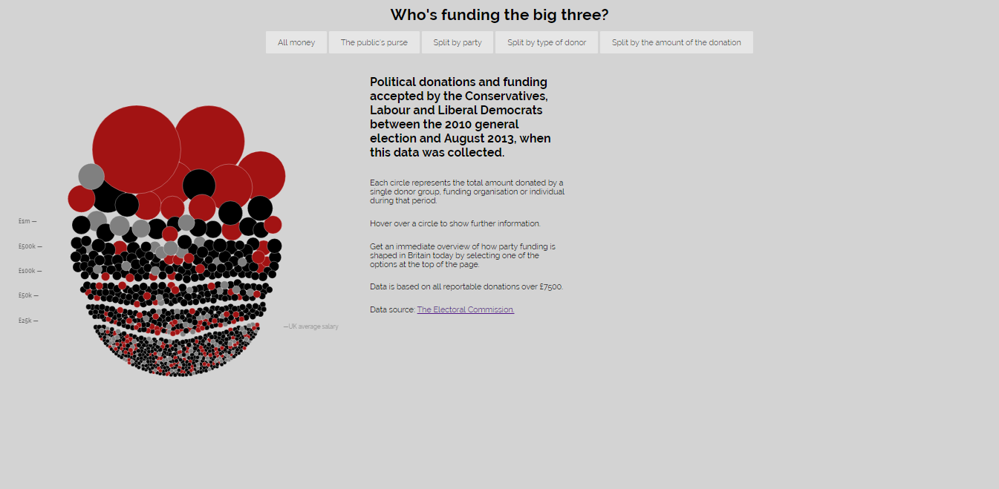
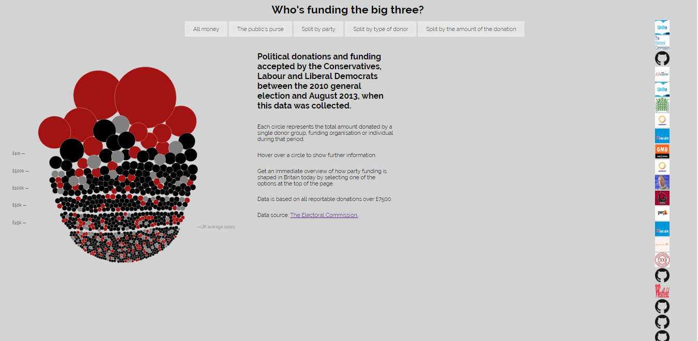

## Οπτικοποίηση Δεδομένων Χορηγιών (UK)

## Τριαντάφυλλος Μάντσιος (2013079)

ΤΕΛΙΚΗ ΑΝΑΦΟΡΑ (9 ΜΑΪΟΥ)

Ονοματεπώνυμο Φοιτητή: Τριαντάφυλλος Μάντσιος

Αριθμός Μητρώου: Π2013079

Εξάμηνο Φοίτησης: Επί Πτυχίω

E-mail: p13mant@ionio.gr

Θέμα Εργασίας: Οπτικοποίηση Δεδομένων Χορηγιών (UK) - Data Visualization

Προσωπικό αποθετήριο του κώδικα: Link Αποθετηρίου του κώδικα https://github.com/p13mant2/D3js-uk-political-donations
Link για το αποθετήριο του κώδικα του 1ου Παραδοτέου: https://p13mant2.github.io/D3js-uk-political-donations
Link για την τελική αναφορά της εργασίας:https://github.com/p13mant2/FinalReportSW

## ΣΥΝΟΨΗ

Η παρούσα εργασία αποτελεί εργασία εξαμήνου στο μάθημα του κ. Χωριανόπουλου, με τίτλο "Τεχνολογία Λογισμικού". Πρόκειται για μία παραλλαγή του κώδικα που παρέχεται μέσω της πλατφόρμας του Github από τον Διδάσκοντα και τους βοηθούς του μαθήματος. Σκοπός της εργασίας είναι να ολοκληρωθούν οι επιμέρους στόχοι όπως αναφέρονται στα Παραδοτέο 1 και Παραδοτέο 2, δηλαδή οι διάφορες τροποποιήσεις στον ήδη υπάρχοντα κώδικα. Στόχος της εργασίας είναι η εξοικίωση του χρήστη γύρω από το κομμάτι της html, της javascript και css. Επίσης, ζητούμενο της εργασίας είναι και η εξοικίωση του χρήστη με την οπτικοποίηση των δεδομένων, βάσει της d3 βιβλιοθήκης της javascript.

## ΕΙΣΑΓΩΓΗ
Η παρούσα εργασία είχε 2 παραδοτέα τα οποία κληθήκαμε να πραγματοποιήσουμε. Το πρώτο παραδοτέο ήταν σαφώς πιο εύκολο απο το δεύτερο παραδότεο.Στο πρώτο παραδοτέο οι αλλαγές ήταν σχετικά εύκολες οπως η αλλαγη χρωματων.Η δυσκολία στο δευτερο παραδοτέο ανεβαινει αό

## ΑΝΑΛΥΣΗ ΣΧΕΤΙΚΩΝ ΕΡΓΩΝ & ΕΡΓΑΛΕΙΩΝ
Για την παρούσα εργασία χρησιμοποίησα την πλατφόρμα του Github, πραγματοποιώντας τις κατάλληλες αλλαγές πάντοτε στα αρχεία newdata.html , chart3.js, new_style.css, index.html, chart.js.

Επίσης, χρησιμοποίησα για την επεξεργασία εικόνων το εργαλείο picresize ώστε να αλλάξω την ανάλυση των φωτογραφιών σε 42x42.

## ΜΕΘΟΔΟΣ ΚΑΙ ΤΕΧΝΙΚΕΣ ΑΝΑΠΤΥΞΗΣ
### Παραδοτέο 1: Αρχικό έργο και ενδιάμεση αναφορά προόδου - 25% (4 Μαρτίου)

1)Αρχικά αφότου έγινε fork στο αντίστοιχο αποθετήριο της εργασίας, ζητήθηκε να πραγματοποιηθεί η σύνδεση της εφαρμογής με την σελίδα μας.

2)Έπειτα, ζητήθηκε να πραγματοποιηθούν οι κατάλληλες αλλαγές ώστε το url της εφαρμογής να δείχνει το username μας, δίχως την κατάληξη "full-viz.html".

3)Στη συνέχεια ζητήθηκε να πραγματοποιηθεί αλλαγή χρωμάτων στις μπάλες με τα δεδομένα, καθώς και στα τρία (3) αντίστοιχα πεδία "Split by party

4) Έπειτα, ζητήθηκε να ακούγεται ήχος κάθε φορά που επιλέγει μια σελίδα ο χρήστης με την εντολή sound.play().

if (name === "group-by-party") {
		sound.play();
		$("#initial-content").fadeOut(250);
		$("#value-scale").fadeOut(250);
		$("#view-donor-type").fadeOut(250);
		$("#view-source-type").fadeOut(250);
		$("#view-party-type").fadeIn(1000);
		return partyGroup();
    
 5) Στην συνεχεια ζητήθηκε να γίνουν οι τροποήσεις ωστε κάθε φορα που ο χρήστης παταει πάνω σε μία μπαλα να του βγάζει το αποτέλεσμα       Google 
   
   .on("click", function(d) { window.open(GoogleSearch + d.donor)});
   
  
  6)Στο κεντρικό αποθετήριο της εργασίας στον φάκελο participants, δημιούργησα ένα .csv αρχείο με τίτλο "2013079.csv" στο οποίο περιέχει    τα στοιχεία μου.
  
  7)Επίσης στον φάκελο photos, τοποθέτησα 5 εικόνες δωρητών με το λογότυπο της κάθε εταιρίας (αν πρόκειται για εταιρία) και με το      πρόσωπο του κάθε δωρητή (αν πρόκειται για φυσικό πρόσωπο). Οι φωτογραφίες με τα logo που ανέβασα είναι αρχεία τύπου .ico με διαστάσεις   42x42.
    
### Παραδοτέο 2: Tελικό έργο - 25% (9 Μαϊου)

Για το δεύτερο παραδοτέο:

Αρχικά ζητήθηκε να εμφανίζεται  η σειρά των εικόνων με τους δωρητές πάνω από τους οποίους πέρασε ο δείκτης του ποντικιού στο γράφημα.Ουσιαστικά πρόκειται για ένα ιστορικό σχετικά με το από ποιους δωρητές έκανε mouseover ο χρήστης.

### Συμπερασματα

Μεσα απο την συγκεκριμένη εργασία ο φοιτητής μαθαίνει να χειρίζεται την HTML.Η συγκεκριμένη εργασία επικεντρώνεται στην d3 βιβλιοθήκη της javascript.Η εργασία ηταν πολυ ενδιαφέρουσα και με εβαλε να αναζητήσω τον τρόπο για να την εκτελέσω και να μελετήσω περαιτέρω την HTML και συγκεκριμένα την βιβλιοθήκη d3 της javascript.

### Βιβλιογραφία
 Youtube Tutorials
 W3-Schools
 StackOverFlow
